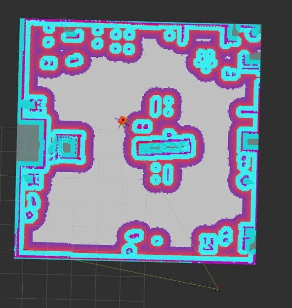
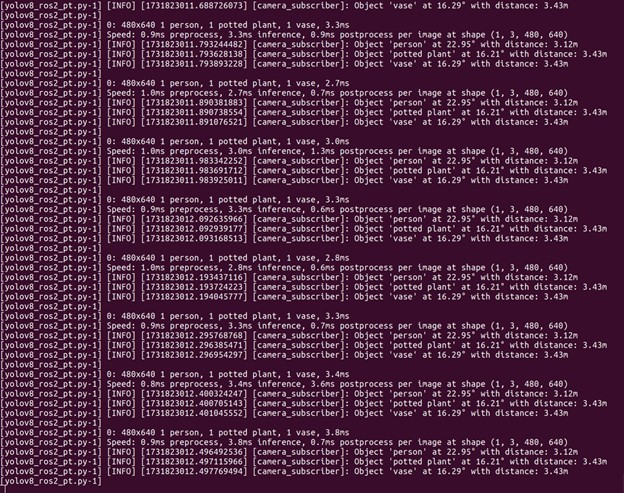
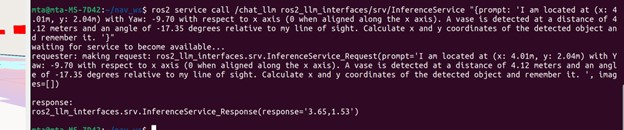

# Autonomous Navigation System with Camera and LiDAR

Welcome to the **Autonomous Navigation System** project repository! This system leverages **camera and LiDAR inputs** to understand its surroundings semantically and employs **Large Language Models (LLMs)** to reason and make navigation decisions in complex environments. Designed for simulation and real-world applications, the project emphasizes efficiency, adaptability, and robustness in autonomous navigation.


---

## Overview

This project integrates multiple advanced technologies to create an autonomous navigation system capable of operating without prior map data. By combining camera and LiDAR inputs with LLM-based reasoning, the system can:

- **Capture Semantic Understanding**: Use camera and LiDAR data for object detection and scene analysis.
- **Generate Contextual Prompts**: Design prompts based on sensor data to communicate with the LLM.
- **Enable LLM Reasoning**: Utilize LLMs to make high-level decisions and guide navigation tasks.
- **Navigate Dynamically**: Adapt to new environments in real time, leveraging semantic understanding.

---

## Features

- **Multi-Sensor Integration**: Combines camera and LiDAR for real-time semantic mapping.
- **LLM-Based Decision Making**: Employs LLMs for high-level navigation reasoning.
- **Simulation and Real-World Ready**: Fully compatible with simulation platforms and designed for real-world implementation.
- **Modular Design**: Separate components for simulation, object recognition, LLM integration, and navigation.
  





---

## Getting Started

### Prerequisites

1. **ROS 2 (Humble or later)**: Install ROS 2 for running the robotic framework.
2. **Simulation Tools**: Install Gazebo and RViz for testing in simulated environments.
3. **SLAM Toolbox**: Set up SLAM Toolbox for real-time mapping and localization.
4. **Object Detection**: Use YOLOv8 for recognizing objects in the environment.
5. **LLM Integration**: Install OLLAMA to enable LLM processing.

### Installation

Follow these steps to set up the environment:

1. Clone this repository:
   ```bash
   git clone https://github.com/your-username/autonomous-navigation-system.git
   cd autonomous-navigation-system
